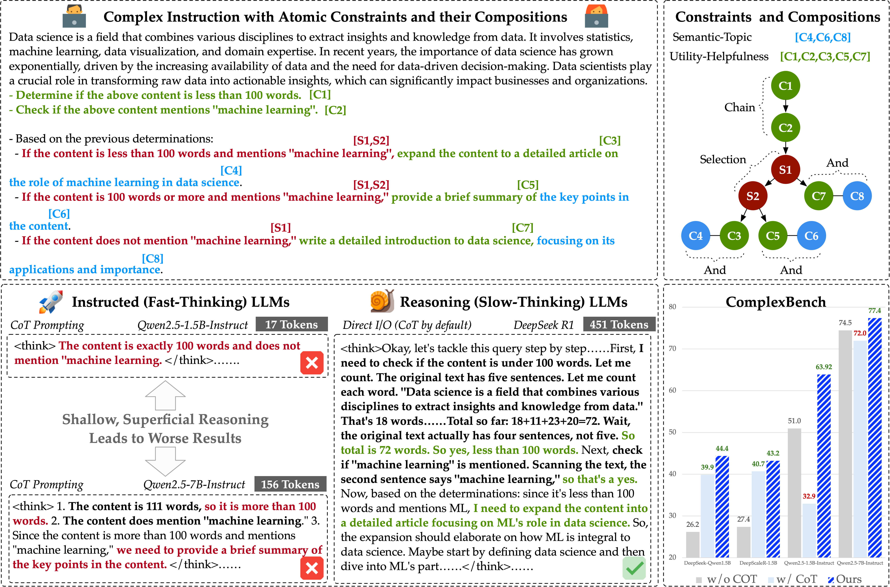
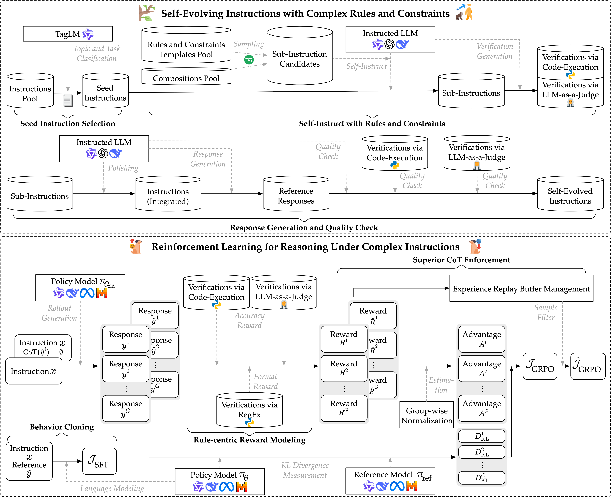

<h1 align="center">Incentivizing Reasoning for Advanced Instruction-Following of Large Language Models</h1>
<p align="center"><i>A Recipe for Building LLM Reasoners to Solve Complex Instructions</i></p>
<div align="center">
  <a href="https://github.com/yuleiqin/RAIF/stargazers"></a>
<a href="https://github.com/yuleiqin/RAIF/network/members"></a>
<a href="https://github.com/yuleiqin/RAIF/pulls"></a>
<a href="https://github.com/yuleiqin/RAIF/issues"></a>
<a href="https://github.com/yuleiqin/RAIF/graphs/contributors"></a>
<a href="https://github.com/yuleiqin/RAIF/blob/master/LICENSE_RAIF"></a>
</div>

This is a repository of the official implementation of the paper "Incentivizing Reasoning for Advanced Instruction-Following of Large Language Models".

Existing large language models (LLMs) face challenges of following complex instructions, especially when multiple constraints are present and organized in paralleling, chaining, and branching structures. One intuitive solution, namely chain-of-thought (CoT), is expected to universally improve capabilities of LLMs. However, we find that the vanilla CoT exerts a negative impact on performance due to its superficial reasoning pattern of simply paraphrasing the instructions. It fails to peel back the compositions of constraints for identifying their relationship across hierarchies of types and dimensions.

To this end, we propose a systematic method to boost LLMs in dealing with complex instructions via incentivizing reasoning for test-time compute scaling. First, we stem from the decomposition of complex instructions under existing taxonomies and propose a reproducible data acquisition method. Second, we exploit reinforcement learning (RL) with verifiable rule-centric reward signals to cultivate reasoning specifically for instruction following. We address the shallow, non-essential nature of reasoning under complex instructions via sample-wise contrast for superior CoT enforcement. We also exploit behavior cloning of experts to facilitate steady distribution shift from fast-thinking LLMs to skillful reasoners. Extensive evaluations on seven comprehensive benchmarks confirm the validity of the proposed method, where a 1.5B LLM achieves 11.74% gains with performance comparable to a 8B LLM.


# News📰
* **`Jun. 2025`:** 🔥🔥🔥**Our preprint paper is released [[arxiv version](https://arxiv.org/pdf/2506.01413)].**
* **`May. 2025`:** 🔥🔥🔥**Codes and data are released. Model checkpoints are available at [🤗HuggingFace](https://huggingface.co/collections/yolay/raif-682b16e5c0c2fa9b73811369).**


# Overview✈️

Our preliminary experiments confirm that the reasoning (e.g., triggered by CoT prompting) of fast-thinking LLMs (instructed models) are often shallow and superficial. Such reasoning only briefly repeats parts of the input requests and fails to extract key components from the complex instructions that are often composed of various sub-instructions, constraints, and rules. On the contrary, existing slow-thinking LLMs (reasoning models) demonstrate superior performance where their deep, organized reasoning truly help the analyses of complex instructions and provide the decomposed action steps to the final answer. Consequently, it is important to incentivize the authentic reasoning of LLMs to solve complex instructions. 



In this project, we present a reinforcement learning-based method for cultivation of the deep reasoning of LLMs.




# Citation🎓
```
@article{qin2025incentivizingreasoningadvancedinstructionfollowing,
      title={Incentivizing Reasoning for Advanced Instruction-Following of Large Language Models}, 
      author={Yulei Qin and Gang Li and Zongyi Li and Zihan Xu and Yuchen Shi and Zhekai Lin and Xiao Cui and Ke Li and Xing Sun},
      year={2025},
      eprint={2506.01413},
      archivePrefix={arXiv},
      primaryClass={cs.CV},
      url={https://arxiv.org/abs/2506.01413}
}
```


# Quick Start🎯

## Data📝

In the present study, we propose to self-evolve complex instructions with various rules and constraints. It consists of three main steps: 1) seed instruction selection; 2) self-instruct with rules and constraints; 3) response generation and quality check.
All the data generated via the proposed generation framework can be found below:
* [[Google Drive Link](https://drive.google.com/file/d/1xgNI609d0cbTjxNAnKDyWCe-bNk7G_mj/view?usp=sharing)]
* [[Baidu NetDisk Link (Download Code: 5whx)](https://pan.baidu.com/s/16m_Ybo0oJcNEAf-urG0lOA)]

After downloading the `data.tar`, unzip it and put the folder `data` inside the current directory.

Alternatively, you can also download our **FULL** data (combining both the DeepScaleR Maths problems and the Complex Instructions) from [🤗HuggingFace](https://huggingface.co/collections/yolay/raif-682b16e5c0c2fa9b73811369).

## Training🏋️

We provide all the training scripts used in the present study for:
* Main Results: `examples/grpo_deepscalar_ifeval_complex_R1`
* Ablation Study: `examples/grpo_deepscalar_ifeval_complex_R1_ablation`

For each training script (e.g., `examples/grpo_deepscalar_ifeval_complex_R1/grpo_qwen_1_1_complex_ifeval_sft_sup.sh`), one need to specify the detailed path to the LLM (e.g., Qwen2.5-7B-Instruct), the output path, the data path, and the wandb key for visualization.
It is noted that we use 16 GPUs for 7B/8B LLMs and 4 GPUs for 1.5B LLMs, respectively. The number of GPUs and their allocation (e.g., number for actor/reference/reward) should be adjusted according to the available computing resources.

Here is an example for submit the training task:

```
bash run_inst_grpo.sh examples/grpo_deepscalar_ifeval_complex_R1/grpo_qwen_1_1_complex_ifeval_sft_sup.sh
```


## Evaluation📊

We provide the evaluation script used in the present study for the following seven comprehensive instruction benchmarks:
* [[IFEval](https://github.com/google-research/google-research/tree/master/instruction_following_eval)]
* [[CELLO](https://github.com/Abbey4799/CELLO)]
* [[CFBench](https://github.com/PKU-Baichuan-MLSystemLab/CFBench)]
* [[ComplexBench](https://github.com/thu-coai/ComplexBench)]
* [[FBBench](https://github.com/PKU-Baichuan-MLSystemLab/FB-Bench)]
* [[FollowBench](https://github.com/YJiangcm/FollowBench)]
* [[InfoBench](https://github.com/qinyiwei/InfoBench)]

The validation script is: `run_complex_bench_all.sh`.
All the benchmarks and their inference and evaluation codes are provided in `COMPLEX_INSTRUCTIONS`.
One need to deploy the trained model using [[vLLM](https://github.com/vllm-project/vllm)] or [[SGLang](https://github.com/sgl-project/sglang)] and then prepare the OpenAI-format chatapi (model_id and model_url).

```
model_id=${your trained model id}
model_url=${your trained model url}
batch_size=64

## Optional: whether to use deepclaude inference; default by N/A
cot_model_id="N/A"
cot_model_url="N/A"

judge_model_id=${your judge model id (we use Qwen2.5-72B-INT8 by default)}
judge_model_url=${your judge model url}

bash run_complex_bench_all.sh ${model_id} ${model_url} ${batch_size} ${cot_model_id} ${cot_model_url} ${judge_model_id} ${judge_model_url}
```

One should first replace the tokenizer path in `COMPLEX_INSTRUCTIONS/run_local_model_openai.py` with the real path. The paths to Qwen, LLaMA, and Mistral tokenizers are needed to load the tokenizers for counting the input and output tokens.


## Main Results🗒️

---
**Table 1** Performance on seven instruction benchmarks. Best/2nd best are marked **bold**/<u>underlined</u>.

| Model                  | Method   | IFEval | CELLO | CF Bench | Complex Bench | FB Bench | Follow Bench | Info Bench | Avg.         |
|------------------------|----------|--------|-------|----------|--------------|----------|--------------|------------|--------------|
| Qwen2.5-1.5B-Instruct  | I/O      | 45.28  | 71.00 | 36.00    | 50.97        | 39.81    | 40.00        | 71.24      | 50.61        |
| Qwen2.5-1.5B-Instruct  | CoT      | 28.65  | 59.30 | 22.00    | 32.94        | 37.31    | 29.28        | 62.22      | 38.81 (-11.79%) |
| Qwen2.5-1.5B-Instruct  | SDC      | 41.95  | 66.10 | 30.00    | 41.70        | 36.52    | 37.39        | 67.55      | 45.89 (-4.71%)  |
| Qwen2.5-1.5B-Instruct  | SFT      | 65.61  | 71.20 | 48.00    | 57.46        | 42.75    | 56.47        | 76.22      | 59.67 (+9.06%)  |
| Qwen2.5-1.5B-Instruct  | Ours     | 44.91  | 73.50 | 53.66    | 63.92        | 58.67    | 59.82        | 81.95      | 62.35 (+11.74%) |
| DeepSeek-Qwen1.5B      | I/O†     | 36.04  | 62.50 | 27.99    | 39.89        | 34.51    | 20.29        | 52.00      | 39.03        |
| DeepSeek-Qwen1.5B      | SFT      | 45.29  | 63.20 | 25.33    | 35.53        | 37.59    | 22.18        | 51.96      | 40.15 (+1.12%)  |
| DeepSeek-Qwen1.5B      | Ours     | 57.67  | 69.00 | 40.00    | 44.38        | 37.78    | 37.79        | 60.48      | 49.58 (+10.54%) |
| DeepScaleR-1.5B        | I/O†     | 41.77  | 65.00 | 30.00    | 40.70        | 40.24    | 26.01        | 60.31      | 43.43        |
| DeepScaleR-1.5B        | SFT      | 48.24  | 62.90 | 28.00    | 36.68        | 35.72    | 26.50        | 54.22      | 41.75 (-1.67%)  |
| DeepScaleR-1.5B        | Ours     | 55.63  | 67.30 | 39.33    | 43.23        | 37.81    | 36.80        | 60.08      | 48.60 (+5.17%)  |
| Qwen2.5-7B-Instruct    | I/O      | 72.82  | 76.50 | 64.33    | 74.47        | 59.29    | 75.03        | <u>85.60</u> | <u>72.58</u>   |
| Qwen2.5-7B-Instruct    | CoT      | 69.50  | 75.20 | 61.66    | 72.00        | 42.65    | 74.86        | 82.13      | 68.28 (-4.29%)  |
| Qwen2.5-7B-Instruct    | SDC      | 60.44  | 72.60 | **65.66**| <u>76.53</u> | <u>60.07</u> | **76.09** | **86.88**  | 71.18 (-1.39%)  |
| Qwen2.5-7B-Instruct    | SFT      | 72.45  | <u>77.50</u> | 63.33 | 74.23 | 58.76 | 75.92 | 84.31 | 72.36 (-0.21%) |
| Qwen2.5-7B-Instruct    | Ours     | 70.06  | **79.20** | <u>65.00</u> | **77.40** | **64.45** | 75.32 | 82.67 | **73.44** (+0.85%) |
| LLaMA3.1-8B-Instruct   | I/O      | <u>77.63</u> | 75.20 | 56.99 | 69.11 | 46.92 | 53.52 | 71.52 | 67.01 |
| LLaMA3.1-8B-Instruct   | CoT      | 60.44  | 65.50 | 47.66    | 56.54        | 32.34    | 37.36        | 58.48      | 54.53 (-12.48%) |
| LLaMA3.1-8B-Instruct   | SDC      | **80.22** | 71.00 | 58.33 | 68.73 | 38.36 | 48.92 | 72.89 | 65.24 (-1.77%) |
| LLaMA3.1-8B-Instruct   | SFT      | 77.26  | 75.80 | 54.00    | 65.24        | 40.16    | 59.56        | 65.30      | 64.92 (-2.09%)  |
| LLaMA3.1-8B-Instruct   | Ours     | 13.49  | 4.6   | 1.33     | 2.71         | 7.14     | 1.08         | 0.51       | 4.06 (-62.95%)  |
| Ministral-8B-Instruct  | I/O      | 59.51  | 76.20 | 62.33    | 70.03        | 54.54    | 73.49        | 84.00      | 68.58        |
| Ministral-8B-Instruct  | CoT      | 48.79  | 61.90 | 49.66    | 61.31        | 39.17    | 61.75        | 79.73      | 57.47 (-11.11%) |
| Ministral-8B-Instruct  | SDC      | 58.59  | 63.60 | 56.99    | 68.32        | 48.06    | 69.37        | 84.08      | 64.14 (-4.43%)  |
| Ministral-8B-Instruct  | SFT      | 68.57  | 66.30 | 48.66    | 67.20        | 37.26    | 54.37        | 76.62      | 59.85 (-8.72%)  |
| Ministral-8B-Instruct  | Ours     | 72.64  | 72.6  | 59.33    | 70.45        | 54.35    | <u>76.08</u> | 75.33      | 68.68 (+0.10%)  |
| DeepSeek-Qwen7B        | I/O†     | 60.81  | 72.39 | 57.99    | 66.86        | 59.59    | 62.80        | 79.64      | 65.73        |
| DeepSeek-Qwen7B        | SFT      | 67.09  | 69.10 | 58.66    | 58.42        | 55.60    | 65.96        | 79.15      | 64.85 (-0.88%)  |
| DeepSeek-Qwen7B        | Ours     | 71.35  | 71.40 | 58.67    | 62.04        | 59.65    | 59.38        | 82.00      | 66.35 (+0.62%) |

---

---
**Table 2** Performance on ComplexBench (Qwen2.5-7B-Instruct). Best/2nd best are marked **bold**/<u>underlined</u>. OD, SC, CNFR, FC, and SR stand for Oracle Decomposition, Self-Consistency, Conifer, FollowComplex, and Self-Refine.

| Category         | ND   | I/O    | OD     | SC     | CNFR   | FC     | SR     | Ours    |
|------------------|------|--------|--------|--------|--------|--------|--------|---------|
| And              | 1    | __85.85__ | 84.27  | 84.03  | 75.10  | 84.77  | 85.66  | **86.57** |
| **Chain**        |      |        |        |        |        |        |        |         |
|       |  1                | 72.18| __74.68__ | 73.54  | 60.95  | 66.27  | **75.25** | 73.96  |
|      |   2                | 70.56| 72.70  | 69.63  | 64.43  | 70.66  | __73.07__ | **76.88** |
| *Avg.*           | -    | 70.96  | 73.18  | 70.57  | 63.59  | 69.60  | __73.59__ | **76.18** |
| **Selection**    |      |        |        |        |        |        |        |         |
|      |   1                | **77.25** | __76.61__ | 72.08  | 60.52  | 71.67  | 69.61  | 73.39  |
|      |  2                | 65.61| __71.83__ | 68.23  | 53.25  | 61.96  | 64.34  | **72.92** |
|      |  3                | __63.39__ | **68.45** | 56.13  | 46.04  | 51.70  | 58.67  | 60.75  |
|    *Avg.*           | -    | 65.67  | **70.49** | 65.83  | 51.92  | 60.92  | 62.69  | __69.16__ |
| **Selection & Chain** | |        |        |        |        |        |        |         |
|      |  2                | __65.64__ | **65.94** | 60.81  | 47.33  | 61.07  | 52.01  | 61.06  |
|      |  3                | 59.70| **65.77** | 64.08  | 48.53  | 57.65  | 60.41  | __65.00__ |
|    *Avg.*           | -    | 62.68  | **65.85** | 62.44  | 47.93  | 59.36  | 56.20  | __63.03__ |
| **Overall**      | -    | 74.47  | __76.26__ | 73.76  | 63.51  | 71.97  | 74.00  | **77.40** |

---


# Acknowledgement🫡

In this project, we follow the SimpleRL and the OpenRLHF framework to prepare the codebase. We acknowledge their great work for open-sourcing the implementations of reinforcement learning algorithms.
* [[SimpleRL](https://github.com/hkust-nlp/simpleRL-reason/)]
* [[OpenRLHF](https://github.com/OpenRLHF/OpenRLHF)]

We also would like to express gratitude to the research community that organize the existing benchmarks for validating the LLMs of solving complex instructions.


# License🪪

Please refer to `License_RAIF` for the license of this project.
